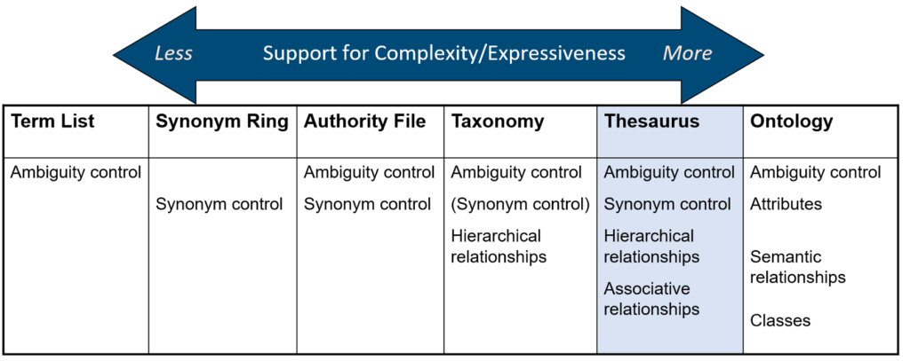
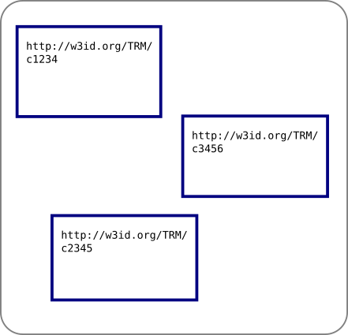
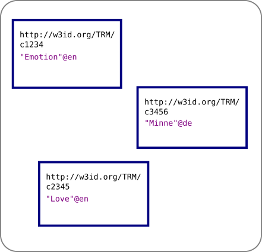
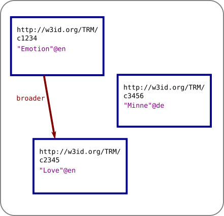
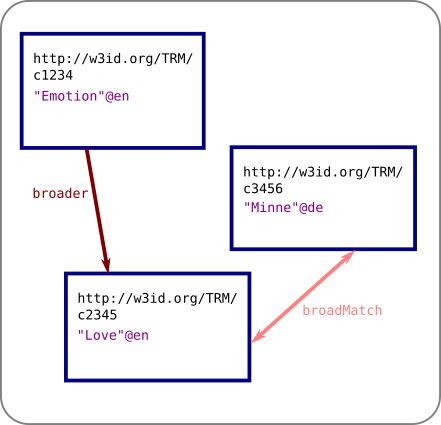
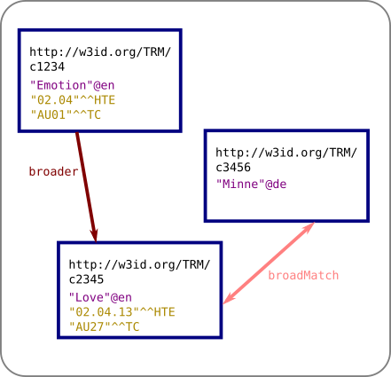

## TOC

* Introduction: Definition of ”Thesaurus“
* Data Model <!-- .element class="fragment"  -->
* Historical Thesaurus of English as a basis <!-- .element class="fragment"  -->
* Current State <!-- .element class="fragment"  -->
* Challenges (as I see them) <!-- .element class="fragment"  -->
* The Way Forward <!-- .element class="fragment"  -->

Notes: Ich glaube, dass der Thesaurus ein spannendes, und auch in gewisser Hinsicht dankbares Puzzlestein für Mitglieder des SFB ist. Spannend, weil es eine ganze Reihe von Herausforderungen gibt, und dankbar insofern, als diese Herausforderungen nicht in erster Linie technischer, sondern inhaltlicher Natur sind. Im Umkehrschluss heißt das auch: viele dieser Herausforderungen müssen mittels der Expertise der verschiedenen Unterprojekte angegangen werden. Dazu möchte ich gerne einladen und ermutigen, und um das zu ermöglichen möchte ich hier einen Überblick geben. 

## Introduction

* Thesaurus vs controlled vocabulary, taxonomy, ontology etc.

<figure>

<figcaption>Source: <a href="https://www.hedden-information.com/what-is-a-thesaurus-and-what-is-it-good-for/">https://www.hedden-information.com/what-is-a-thesaurus-and-what-is-it-good-for/</a>.</figcaption>
</figure>

Notes: Das Wort "Thesaurus" hat fach- und kontextabhängig unterschiedliche Bedeutungen. Und selbst innerhalb des SFB sprechen wir über zwei unterschiedliche Dinge jeweils als Thesaurus:
1. Thesaurus im weiteren Sinne: das Gesamtsystem, das Konzepte mit Textstellen verknüpft, und auch den Zugang dazu ermöglicht.
2. Thesaurus im technischen (Information Retrieval) Sinne: ein Spezialfall eines kontrollierten Vokabulars, dass im Grunde eine Konzepthierarchie modelliert. 
In erster Linie geht es heute um die zweite Definition, auch wenn die Motivation und das Ziel des Ganzen natürlich ein System im ersten Sinne ist.

## Data Model

### SKOS

<ul>
<li class="fragment" data-fragment-index="1">based on <b>concepts</b>, identified by URIs</li> 
<li class="fragment" data-fragment-index="2">concepts get various kinds of <b>labels</b> in different languages, e.g. <em>"Love"@en</em></li>
<li class="fragment" data-fragment-index="3">concepts get connected by <b>hierarchical relations</b> like <em>"narrower"</em> to form a taxonomy (directed graph, not a tree)</li>
<li class="fragment" data-fragment-index="4">concepts get connected by <b>non-hierarchical relations</b> to express mappings, e.g. <em>"closeMatch"</em></li>
<li class="fragment" data-fragment-index="5">concepts can have <b>notations</b> to model traditional signatures e.g. <em>"01.04.02"</em></li>
<li class="fragment" data-fragment-index="6">basically everything can have <b>notes</b> attached to it</li>
</ul>

  
  
  
  
  

Notes: Bevor ich den aktuellen Stand zeige, ganz kurz ein technischer Exkurs. Unser Thesaurus (im IR Sinne) war ja zunächst ein Datensatz. Dieser hat eine recht simple Struktur, die dem SKOS Modell folgt.
SKOS ("Simple Knowledge Organization System") ist eine _W3C recommendation_ und erlaubt uns, anders als die HTE, anschlussfähig für verschiedene eigene Frontends zu sein, aber auch an weitere, externe Knowledge Graphs.
We see that while "Emotion" is parent of "Love" in HTE, in TC they are sibling elements. (Aside: the TC concept "AU":"Emotion" is not mapped by the HTE editors.)

## Historical Thesaurus of English

* project of the University of Glasgow  <!-- .element class="fragment"  -->
* Website: HTE, based on ODE  <!-- .element class="fragment"  -->
* specific for English language (but various kinds of English)  <!-- .element class="fragment"  -->
* combines rich taxonomy with concrete utterances from ODE  <!-- .element class="fragment"  -->

Notes: Schon von Beginn an wurde entschieden, dass der TRM nicht bei Null anfangen, sondern auf dem HTE aufbauen sollte. Wichtig ist dabei, dass
1. HTE eigentlich ein T im ersten Sinne ist, und
2. gerade deshalb unser Zugang leider sehr eingeschränkt ist.

### Access to the HTE

* not Open Access  <!-- .element class="fragment"  -->
* no API (except crawling the website)  <!-- .element class="fragment"  -->
* agreement on re-use, BUT…  <!-- .element class="fragment"  -->

### Access to the HTE (cont.)

* we only have access to the taxonomy data <!-- .element class="fragment"  -->
* two different sets of categories  <!-- .element class="fragment"  -->
  * full HTE set, e.g. '01.04.02': "Anthropocentrism" (~144,000 concepts)
  * thematic category set (TC), e.g. 'AD01': "Science of mankind" (4,033 concepts)
  * TC is supposed to be used for human queries and visualizations; it is not as readily accessible via the website
* we only have access to the TC set!  <!-- .element class="fragment"  -->

<!-- .slide: data-background-iframe="https://ht.ac.uk/category/#id=39622" -->

Notes: The TC mapping is not easily searchable in the web interface, but it is visible by using the detail view of a full HTE category.
While in theory the TC set of categories seems like a good fit for our project, in practice I found it to be _weird_. We will see some of the weirdness
when I give you a quick glance on what we currently have.

## Current State

### Read-Only

* HTE dataset has been converted to SKOS
* Skosmos instance available

<!-- .slide: data--background-iframe="http://locahost/Skosmos/en/" -->

Notes: Übersicht über toplevel Konzepte. Beispielhafter Eintrag. TODO: ändern zu public Skosmos instance.

### we see that

* there are many "top-level" concepts
* some gaps in the hierarchy
* our "big three" are not special in this taxonomy
  * AA: "world"
  * AR: "mind"
  * AY: "society"
* the layer of a concept inside the hierarchy is not meaningful 

Notes: (e.g. Concept path 'AC01' suggests that 'AC' should exist, but it doesn't.
Concept path 'AC02' suggests that 'AC' should exist, but it doesn't.
Concept path 'AP03c05a' suggests that 'AP03c05' should exist, but it doesn't.)

### Editable

* VocBench?
* EVOKS?
* vocabseditor?
* other…?

Notes: Selbst wenn wir mit dem Zustand des TC zufrieden wären, benutzen wir andere Sprachen als Englisch. Wir müssen also diese Hierarchie weiterentwickeln, und da wird es eigentlich erst wirklich spannend.

## Challenges
#### (as I see them…)

### Challenges

* Modelling / Extension  <!-- .element class="fragment"  -->
* Organizational  <!-- .element class="fragment"  -->
* Connection to textual sources  <!-- .element class="fragment"  -->

Notes: Drei Gebiete: erstens soll die Struktur angemessen sein für unsere Daten. Wir werden sie also erweitern müssen, und die Frage ist: wie genau?
Zweitens die organisatorische Frage, _wer_ soll das tun? Wann? Wie häufig? Am Ende ist ein Thesaurus eine _Referenz_, eine gewisse Stabilität muss gewährleistet sein. Außerdem erfordert die Arbeit am Graphen ein gewisses Hintergrundwissen.
Drittens: Der Thesaurus soll Dinge erschließen, also auffindbar und nutzbar machen. Inwiefern? In welcher Form?

## The Way Forward

* SIG "TRM"!
* Modelling Case Studies
* Use Case Studies

Notes: Wie ich schon erwähnt habe: über die angemessene Struktur, die notwendigen Eigenschaften, und letztendlich den Inhalt des TRM können wir nur über die Kompetenz der Unterprojekte angemessen entscheiden. 

